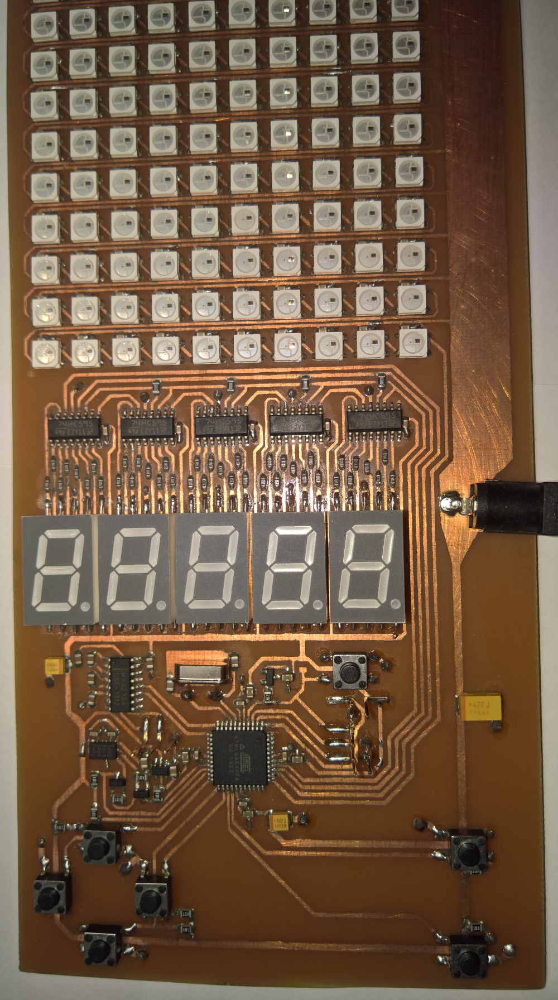
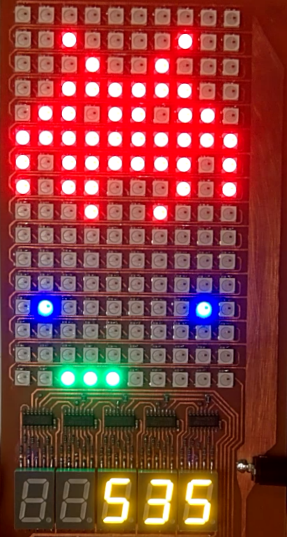
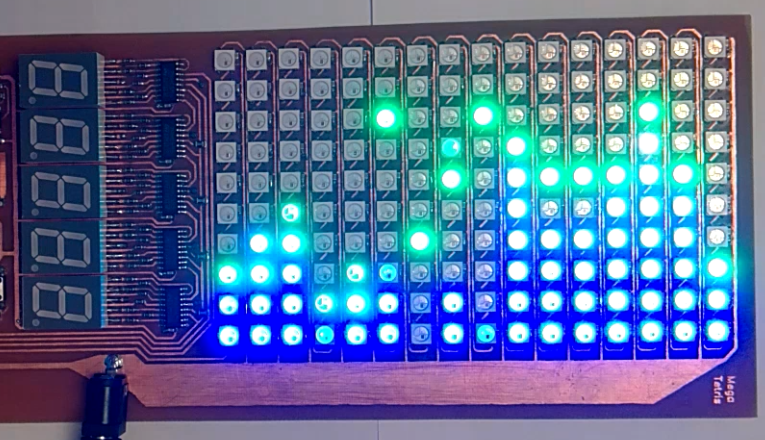

#### ATmega RGB LED display with pack of classic games and UART control
##### (MEGA TETRIS board)

**What's this**

This project is RGB LED display (16x10) based on WS2812B LEDs. Its core is ATmega644pa controller running on 16 MHz frequency. The board has several buttons (up, down, left, right, forward, back, reset) and ADXL345 accelerometer. It also has 5-digit numeric display. There're also UART interface (MAX232A-based) and SPI programming interface for USBASP or similar programmer.

**This project contains:**

- Board schematic
- PCB
- C++ firmware code for ATmega644p(a) (uses C++11 features, compiles in Atmel Studio 6.2 or later)
  - Animated menu
  - Games (support buttons or accelerometer control and high scores)
     - Snake
     - Tetris
     - Space invaders
     - Asteroids
     - Maze
  - UART-based control protocol
  - Debug mode
- [Winamp player](http://www.winamp.com/) visualization plugin
  - Three different visualizations
- Board Debug Console C# code for Windows

**[Demo video](https://www.youtube.com/watch?v=IZfsuTzZs8U)**

**Photos**

